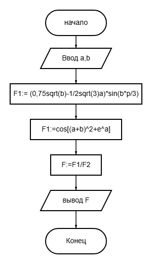
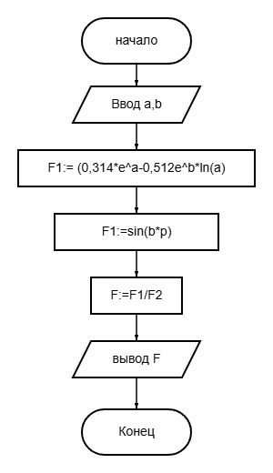
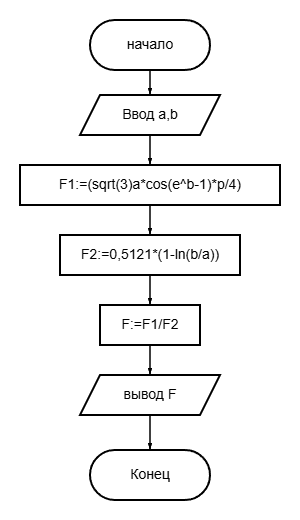
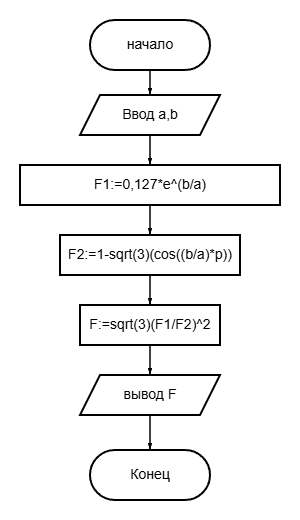
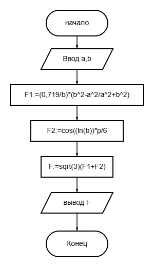
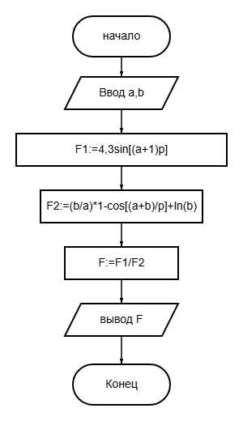
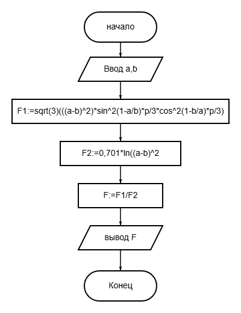
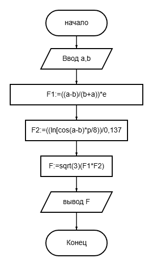

# Лабароторная работа №1  
### Задание 1   
#### N1  
Алг   
вещ a, b, F  
нач  
ввод a, b  
F:= ((0,75sqrt(b)-1/2sqrt(3)a)*sin(b*p/3))/cos[(a+b)^2+e^a]  
вывод F  
кон  
Блок-схема:   

#### N3  
Алг   
вещ a, b, F  
нач  
ввод a, b  
F:=0,314*e^a-0,512e^b*ln(a)/sin(b*p)  
вывод F  
кон  
Блок-схема:  
  
#### N5
Алг   
вещ a, b, F  
нач  
ввод a, b  
F:=(sqrt(3)a*cos(e^b-1)*p/4)/0,5121*(1-ln(b/a))  
вывод F  
кон  
Блок схема:   
  
#### N7  
Алг   
вещ a, b, F  
нач  
ввод a, b  
F:=sqrt(3)((0,127*e^(b/a)/1-sqrt(3)(cos((b/a)*p)))^2)  
вывод F  
кон  
Блок схема:  
  
#### N9  
Алг  
вещ a, b, F  
нач  
ввод a, b  
F:=sqrt(3)((0,719/b)*(b^2-a^2/a^2+b^2)+cos((ln(b))*p/6)  
вывод F  
кон  
Блок схема:  
  
#### N11  
Алг  
вещ a, b, F  
нач  
ввод a, b  
F:=(4,3sin[(a+1)p])/((b/a)*1-cos[(a+b)p]+ln(b))  
вывод F  
кон  
Блок схема:  
  
#### N13  
Алг   
вещ a, b, F  
нач  
ввод a, b  
F:=(sqrt(3)(((a-b)^2)*sin^2(1-a/b)*p/3*cos^2(1-b/a)*p/3))/0,701*ln((a-b)^2)  
вывод F  
кон  
Блок схема:  
  
#### N15  
Алг   
вещ a, b, F  
нач  
ввод a, b  
F:=sqrt(3)(((a-b)/(b+a))*e*((ln[cos(a-b)*p/8))/0,137)  
вывод F  
кон  
Блок схема:  
  
### Задание 2  
#### N1  
алг  
нач  
вещ x, y  
ввод x, y  
если y <= 1 и x <= 1 и -x <= y то
вывод "Да"  
иначе  
вывод "Нет"  
все  
кон 
#### N3  
алг  
нач  
вещ x, y  
ввод x, y  
если x >= 0 и y >= x - 6 и x*x + y*y <= 36 то  
вывод "Да"  
иначе  
вывод "Нет"  
все  
кон  
#### N5  
алг  
нач  
вещ x, y  
ввод x, y  
если y <= 1 - abs(x) и x*x + y*y <= 1 то  
вывод "Да"  
иначе  
вывод "Нет"  
все  
кон  
#### N7  
алг  
нач  
вещ x, y  
ввод x, y  
если max(abs(x), abs(y)) <= 1 и y >= -abs(x) то  
вывод "Да"  
иначе  
вывод "Нет"  
все  
кон  
#### N9  
алг  
нач  
вещ x, y  
ввод x, y  
если 0 <= y и y <= min(1 - x*x, 1 + x) то  
вывод "Да"  
иначе  
вывод "Нет"  
все  
кон  
#### N11  
алг  
нач  
вещ x, y  
ввод x, y  
если max(abs(x), abs(y)) <= 1 и 0 <= y - x и y - x <= 1 то  
вывод "Да"  
иначе  
вывод "Нет"  
все  
кон  
#### N13  
алг  
нач  
вещ x, y  
ввод x, y  
если x >= 0 и 1 <= x*x + y*y и x*x + y*y <= 4 то  
вывод "Да"  
иначе  
вывод "Нет"  
все  
кон  
#### N15  
алг  
нач  
вещ x, y  
ввод x, y  
если max(-0.5 * x, 1.5 * x) - 1 <= y и y <= min(0, x) + 2 то  
вывод "Да"  
иначе  
вывод "Нет"  
все  
кон  
### Задание 3  
#### N1  
алг  
нач  
вещ S, Sn, E  
цел n  
S := 0  
k := 1  
ввод E  
пока   
Sn := 1 / (n + 1) ^ n  
если Sn < E то  
прервать  
все  
S := S + Sn  
n := n + 1  
конец  
вывод S  
кон  
#### N3  
алг  
нач  
вещ S, Sn, E  
цел n  
S := 0  
n := 1  
ввод E  
пока истина делай  
Sn := 1 / ((2^n) - 3) * ((3^n) - 2)  
если Sn < E то  
прервать  
все  
S := S + Sn  
n := n + 1  
конец  
вывод S  
кон  
#### N5  
алг  
нач  
вещ S, Sn, E  
цел n  
S := 0  
n := 1  
ввод E  
пока   
Sn := 2n/((3^n)-1)*((3^n)-1)  
если Sn < E то  
прервать  
все  
S := S + Sn  
n := n + 1  
конец  
вывод S  
кон  
#### N7  
алг  
нач  
вещ S, Sn, E  
цел n  
S := 0  
n := 1  
ввод E  
пока   
Sn := ((1/(3^n))+K)  
если Sn < E то  
прервать  
все  
S := S + Sn  
n := n + 1  
конец  
вывод S  
кон  
#### N9  
алг  
нач  
вещ S, Sn, E  
цел n  
S := 0  
n := 1  
ввод E  
пока   
Sn := 1/(n+2)^n+1  
если Sn < E то  
прервать  
все  
S := S + Sn  
n := n + 1  
конец  
вывод S  
кон  
#### N11  
алг  
нач  
вещ S, Sn, E  
цел n  
S := 0  
n := 1  
ввод E  
пока   
Sn := 1/((3^n)-1)  
если Sn < E то  
прервать  
все  
S := S + Sn  
n := n + 1  
конец  
вывод S  
кон  
#### N13  
алг  
нач  
вещ S, Sn, E  
цел n  
S := 0  
n := 1  
ввод E  
пока   
Sn := n-1/(2^n)-1  
если Sn < E то  
прервать  
все  
S := S + Sn  
n := n + 1  
конец  
вывод S  
кон  
#### N15  
алг  
нач  
вещ S, Sn, E  
цел n  
S := 0  
n := 1  
ввод E  
пока   
Sn := 5n/2n^n+1  
если Sn < E то  
прервать  
все  
S := S + Sn  
n := n + 1  
конец  
вывод S  
кон
